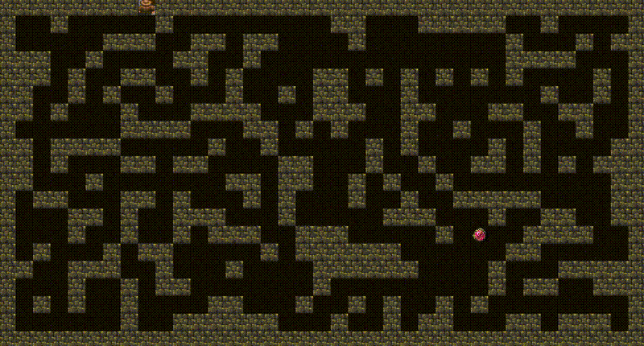
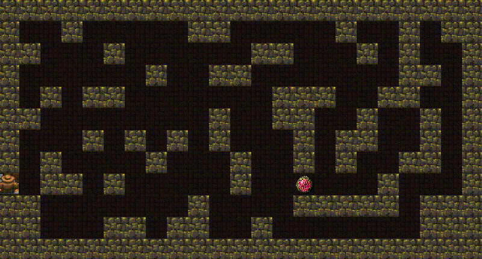
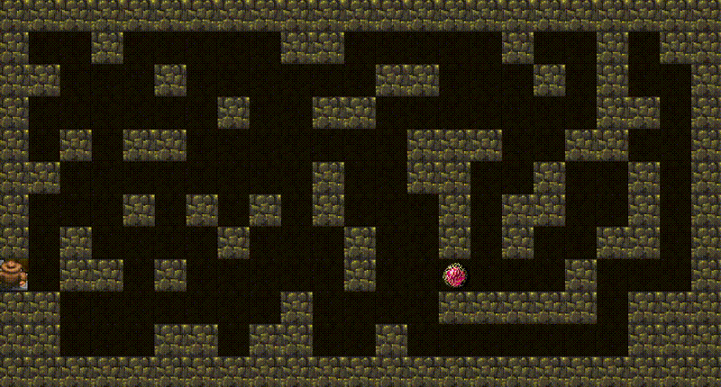

# Orb of Lots — Online Graph Search Investigation

### Designing an Online Graph Search Algorithm for Unknown Environment Exploration

> Exploring how classical search principles can be adapted to unknown environments.

---

## Project Overview

The Orb of Lots is an online graph exploration problem in which an autonomous agent must locate a hidden Orb within an initially unknown cavern before successfully escaping. Although the complete challenge consists of both an exploration phase and an escape phase, this project focuses exclusively on the exploration phase, where the objective is to locate the Orb as efficiently as possible while gradually discovering the structure of the environment.

During exploration, the agent has access only to information available from its current position. At each step, it knows its current location, the neighbouring nodes that can be reached next, and the straight-line distance to the Orb. The remainder of the graph is revealed only through physical exploration, meaning every movement decision must be made using incomplete information. This places the problem within the domain of online graph search, where planning and exploration occur simultaneously.

The aim of this project was to investigate how principles from classical graph search can be adapted to this online setting. Multiple search strategies were implemented, benchmarked, and evaluated to understand which ideas remain effective when the search graph is initially unknown. The investigation ultimately led to the design of Coverage-Biased Frontier Utility Search $(\lambda=1.5)$, a frontier-based exploration algorithm proposed in this project that extends frontier search by introducing a lightweight coverage heuristic to bias exploration towards frontier regions expected to maximise the amount of newly discovered environment.

---

<p align="center">
  
  <br/>
  <em>Coverage-Biased Frontier Utility Search (λ = 1.5) — Seed 113837</em>
</p>

---

## Key Features

- Multiple online graph search algorithms
- Coverage-Biased Frontier Utility Search
- Bulk benchmarking framework with reproducible fixed-seed experiments
- Statistical benchmark analysis tools
- Comprehensive Javadocs and documentation
- Unit tests for core components

--- 

## Motivation

The exploration phase can be viewed as an **online search problem**, in which the search policy is a function

$$
\pi : S_t \rightarrow A_t,
$$

mapping the information available to the agent at time $t$ ($S_t$) to its next action ($A_t$). Unlike classical graph search, the state $S_t$ represents only a partial view of the environment, consisting of the explored graph, neighbouring frontier nodes, and the straight-line distance to the Orb.

If exploration is treated purely as the task of visiting unknown nodes, then simple strategies such as **Random Walk** and **Depth-First Search (DFS)** provide natural starting points. These algorithms require little or no prior knowledge of the environment and demonstrate that systematic exploration alone can successfully locate the Orb. However, they make movement decisions without explicitly considering the trade-off between progressing towards the Orb and maximising the information gained from each exploration step.

This naturally raises the question of whether ideas from **classical heuristic search**, such as **A\***, can be adapted to improve exploration. In classical search, movement decisions are typically guided by an evaluation function

$$
f(n)=g(n)+h(n),
$$

where $g(n)$ represents the cost accumulated so far and $h(n)$ estimates the remaining cost to the goal. This formulation assumes that candidate paths can be evaluated over a complete search graph before traversal begins.

During online exploration, however, these assumptions no longer hold. Since large portions of the graph remain unknown, an effective search strategy must balance progressing towards the Orb with discovering new areas of the environment. One promising family of online search algorithms is **frontier-based search**, which augments the classical evaluation function with an additional notion of frontier utility,

$$
f(n)=g(n)+h(n)+u(n),
$$

where $u(n)$ represents the expected utility of moving towards an unexplored frontier.

Building upon these ideas, this investigation explores how the classical evaluation function can be progressively refined for online exploration, ultimately leading to the design of the final exploration algorithm presented in the following section.

---

## Coverage-Biased Frontier Utility Search

While the frontier-based heuristic introduced an explicit notion of exploration utility through the term $u(n)$, encouraging the agent to move towards unexplored regions of the graph, it did not distinguish between frontiers that were equally attractive to reach, but very different in the amount of new environment they were expected to reveal. Two frontier regions could therefore appear equally attractive according to the heuristic, despite one revealing substantially more of the previously unseen environment than the other.

This suggested that the evaluation function was still missing an important notion of exploration value. In addition to estimating the utility of moving towards a frontier, it should also estimate the **expected coverage** obtained by exploring beyond that frontier. This motivated the introduction of an additional coverage term, resulting in the modified evaluation function

$$
f(n)=g(n)+h(n)+u(n)+\lambda c(n),
$$

where $c(n)$ represents a lightweight estimate of the expected amount of previously unseen environment revealed by exploring a frontier, and $\lambda$ is a tunable parameter controlling the influence of this additional exploration term.

The resulting algorithm, **Coverage-Biased Frontier Utility Search**, extends frontier-based exploration by favouring frontier regions expected to maximise the amount of newly discovered environment while preserving the original frontier utility formulation. Rather than estimating true information gain, the coverage heuristic uses frontier density as a lightweight proxy for the amount of unexplored environment likely to be revealed, allowing the strategy to remain computationally inexpensive while encouraging exploration of promising regions. Based on experimental evaluation over 500 fixed seeds, a coverage weight of $λ = 1.5$ was selected, achieving the lowest mean movement count and strongest worst-case performance of any algorithm tested.

<table>
  <tr>
    <td></td>
    <td></td>
  </tr>
  <tr>
    <td align="center"><b>Coverage-Biased Frontier Utility Search (λ = 1.5)</b></td>
    <td align="center"><b>Greedy DFS</b></td>
  </tr>
  <tr>
    <td colspan="2" align="center">Seed 1138364087731029197</td>
  </tr>
</table>

The complete design rationale, implementation details and experimental evaluation are discussed in the accompanying **Algorithm Design** and **Benchmarking documentation**.

---

## Repository Structure

```text
.
├── temple/
│   ├── src/
│   │   ├── main/java/student/
│   │   │   ├── searchalg/          # Online search algorithm implementations
│   │   │   └── benchmark/          # Benchmark framework, data collection and analysis
│   │   └── test/java/              # Unit and integration tests
│
├── docs/
│   ├── assets/                     # GIF demonstrations
│   ├── algorithm-design.md         # Evolution of the final exploration algorithm
│   ├── benchmarking.md             # Experimental methodology and performance evaluation
│   ├── testing.md                  # Testing strategy and validation
│   └── architecture.md             # Software architecture and design decisions
│
├── benchmark-data/                 # Benchmark CSV output and experimental data
│   ├── seeds.txt                   # Fixed seed set used for all experiments
│   └── *.csv                       # Per-algorithm benchmark results (500 seeds each)
├── README.md                       
└── LICENSE
```

---

## Build and Run

### Requirements

- Java 21
- Gradle (or the included Gradle Wrapper)

### Build

```bash
./gradlew build
```

### Run the graphical interface
```bash
./gradlew :temple:run -PchooseMain=main.GUImain
```

### Run the text interface
```bash
./gradlew :temple:run -PchooseMain=main.TXTmain
```

### Run the benchmark suite (generate and analyse results)
```bash
./gradlew :temple:run -PchooseMain=student.benchmark.BulkBenchmarkRunner
./gradlew :temple:run -PchooseMain=student.benchmark.analysis.BenchmarkAnalysisRunner
```
This command executes the complete benchmark suite, writes the results to `benchmark-data/` as CSV files, and then generates the statistical summary used throughout the benchmarking documentation.


---

## Project Documentation

The repository is accompanied by detailed documentation describing the algorithmic investigation, software design, benchmarking methodology and testing strategy.

| Document | Description |
|----------|-------------|
| `docs/algorithm-design.md` | Evolution of the search algorithms and the development of Coverage-Biased Frontier Utility Search. |
| `docs/benchmarking.md` | Benchmark methodology, evaluation metrics and comparative performance analysis. |
| `docs/testing.md` | Unit testing strategy, benchmark validation and code coverage. |
| `docs/architecture.md` | Software architecture, design patterns and engineering decisions. |

---

## Acknowledgements

The Orb of Lots framework was originally developed by Eric Perdew, Ryan Pindulic, and Ethan Cecchetti at Cornell University's Department of Computer Science. This repository contains my own exploration algorithms together with the accompanying benchmarking and software engineering infrastructure.

---

## License

Released under the MIT License.

---

## Author

Chamundeshwari Rajputri Vadamalai